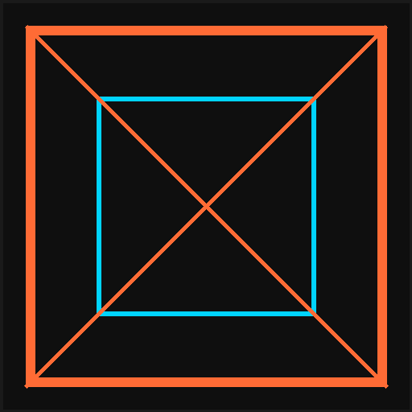

<p align="center">
	
</p>

<h1 align="center">Divizion — Site officiel</h1>

<p align="center">
	Serveur Minecraft géopolitique sur carte mondiale. Construisez, collaborez et jouez dans un monde persistant.
</p>

<p align="center">
	
	
	
	
	
</p>

## **Aperçu**
- **Projet**: Site web officiel de Divizion (Next.js App Router)
- **Objectif**: Présenter le serveur, télécharger le launcher, suivre la roadmap et rejoindre la communauté
- **Tech**: Next.js 15, React 19, TypeScript, Tailwind CSS, ESLint

## **Liens Utiles**
- **Discord**: https://discord.gg/CrfM2WVKYh
- **Organisation GitHub**: https://github.com/divizion-project
- **Téléchargement Launcher (toutes versions)**: https://github.com/divizion-project/Divizion-Launcher/releases
- **Launcher**: via page `Launcher` du site
- **Roadmap**: via page `Roadmap` du site

## **Prérequis**
- `Node.js` 18+ (recommandé: 20 LTS)
- `npm` 9+ (ou `pnpm`/`yarn` si vous préférez)

## **Démarrage rapide**
```bash
git clone https://github.com/divizion-project/divizion-project.github.io.git
cd divizion-project.github.io
npm install
npm run dev
```

Ensuite ouvrez: `http://localhost:3000`

## **Scripts NPM**
- `npm run dev`: lance le serveur de développement Next.js
- `npm run build`: construit l’application pour la prod
- `npm start`: démarre la build en mode production
- `npm run lint`: exécute ESLint

## **Structure**
```
app/
	layout.tsx        # Layout global
	page.tsx          # Accueil
	launcher/         # Page du launcher
	news/             # Page des news
	roadmap/          # Page de la roadmap
components/
	layout/           # Navbar, Footer, SiteLayout
	transitions/      # Transitions de page
	ui/               # Composants UI (ex: LoadingCube)
lib/                # Constantes & utilitaires
public/             # Assets publics (logo, icônes, images)
styles/             # Styles globaux (Tailwind)
```

## **Développement**
- Éditez les pages dans `app/`
- Les composants réutilisables sont dans `components/`
- Les assets (logo, images) sont dans `public/` (ex: `public/logo.png`)

## **Déploiement**
- Build de production:
	```bash
	npm run build
	npm start
	```
- Compatible hébergeurs Node (VPS, PaaS) et plateformes type Vercel.
- Pour GitHub Pages, un rendu SSR n’est pas adapté tel quel. Préférez un hébergeur Node ou Vercel.

## **Personnalisation**
- Logo navbar: `public/images/icones/logo-small-navbar.webp`
- Logo README: `public/logo.png`
- Liens externes: `lib/constants.ts` (`DISCORD_LINK`, `GITHUB_LINK`)
- Couleurs & styles: `styles/globals.css` et Tailwind (`tailwind.config.ts`)

## **Contribuer**
- Forkez le repo et créez une branche de feature
- Respectez le style existant, exécutez `npm run lint`
- Ouvrez une Pull Request vers `main`

## **Crédits**
- @Divizion 2025 — Site officiel
- Icônes et marques appartiennent à leurs propriétaires respectifs

---

Besoin d’aide ? Rejoignez-nous sur Discord: https://discord.gg/CrfM2WVKYh
